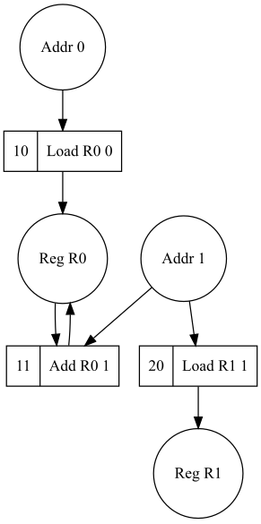

NB: please take a look at [Fine Grained Stateful Computations](https://github.com/tuura/fine-grained-state) project, which uses a next iteration of the ideas used in this project.  

# Inglorious Adding Machine

Hi there! I am an Inglorious Adding Machine --- a model of a minimalistic processor
architecture.

My design was inspired by [OISCs](https://en.wikipedia.org/wiki/One_instruction_set_computer).

## Features

* Write programs using a Haskell-embedded assembly language.

* Extract static data dependencies of instructions and programs and derive concurrency oracles.

## Project organization

IAM is a very simple architecture. It has 4 general purpose registers, 2 flags and 7 commands.

The project is split into following modules:

* `Metalanguage` contains the definition of the polymorphic state-transformer metalanguage, in terms of which the semantics of instructions is defined.

* `Machine.Types` module contains the Haskell types encoding the domain entities: memory, registers, instructions, etc.

* `Machine.State` module contains the representation of the microarchitectural state.

* `Machine.Instruction` contains the syntax of IAM instructions.

* `Machine.Semantics` module contains the semantics of the instructions, i.e. how does each instruction transforms the machine state.

* `Machine.Assembly` module contains an embedded monadic combinator library designed to construct IAM programs using Haskell's `do`-notation.

* `Machine.Semantics.Dependencies` statically calculate data dependencies of computations described in terms of the `Applicative` metalanguage, plot dependency graphs and derive concurrency oracles for instructions and programs (read further for examples.)

## Instruction set

The instruction set has 7 commands defined in `Machine.Assembly`:

* `load Register MemoryAddress` loads a value to a register from a given memory address.
* `loadMI Register MemoryAddress` loads a value to a register from a given memory address using the memory indirect access mode.
* `set Register SImm8` loads an 8-bit signed immediate value to a register.
* `store Register MemoryAddress` stores a value from a register to a given memory address.
* `add Register MemoryAddress` adds a value located in the memory to one in a register.
* `jump SImm10` performs an unconditional jump.
* `jumpZero SImm10` performs a jump if `Zero` flag is set.
* `halt` stops the machine operation.

These commands later get desugared into constructors of `Machine.Instruction.Instruction` data type.

## Examples

As a simple example consider two programs.

The first one loads a value from the memory location `0` to the register `R0`
and then adds up to it the value from the memory location `1`:

```haskell
Load R0 0
Add R0 1
```

The second one just load the value from the memory location `1` in the register `R1`:

```
Load R1 1
```

Both of these programs comprise only *static* instructions, their semantics is
described in the `Applicative` metalanguage. We can extract data dependencies from the
metalanguage descriptions and plot them as graphs:

```haskell
ghci> Just g1 = programDataGraph (zip [10..] [Load R0 0, Add R0 1])
ghci> Just g2 = programDataGraph (zip [20..] [Load R1 1])
ghci> drawGraph (overlay g1 g2)
```
We retrieve graphs `g1` and `g2`, `overlay` them and export as a `.dot` file, which
may be later rendered in `svg` or any other format:




